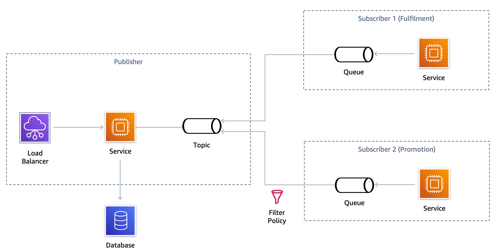
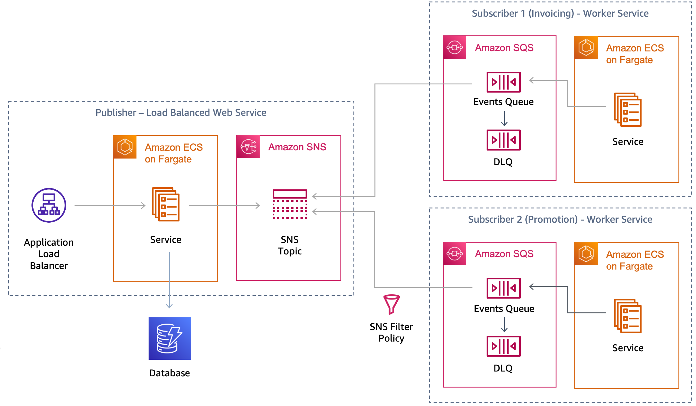

# Implementing a pub/sub architecture with AWS Copilot

The [AWS Copilot CLI](https://aws.github.io/copilot-cli/) is a tool that since its [launch in 2020](https://aws.amazon.com/blogs/containers/introducing-aws-copilot/), developers have been using to build, manage, and operate Linux and Windows containers on [Amazon Elastic Container Service (Amazon ECS)](https://aws.amazon.com/ecs/), [AWS Fargate](https://aws.amazon.com/fargate/), and [AWS App Runner.](https://aws.amazon.com/apprunner/)

This repository contains code for a publisher and two subscriber “worker” services that respectively publish and consume events in a [pub/sub architecture](https://aws.amazon.com/pub-sub-messaging/).

The high-level architecture is shown below.

You can easily build a sample pub/sub architecture by leveraging the AWS Copilot CLI. Rather than losing time creating all of the infrastructure and policies needed for your services, you can leverage some service templates and commands that help you deploy all the needed resources, allowing you to focus on what really matters. Creating publisher and subscribers has never been easier, as the AWS Copilot CLI can take care of creating SNS Topics, SQS Queues, Subscriptions, Filtering policies, DLQ, re-drive configuration and the URI injection into the service themselves.

A technical how-to blog tutorial on the deployment can be found here:

- https://aws.amazon.com/blogs/containers/implementing-a-pub-sub-architecture-with-aws-copilot/

## Releases

- v1.0 : This repository has been published on <DATE> as support material for the technical how-to blog tutorial.

## Authors and acknowledgment

- Rafael Mosca

## Contributing

AWS Copilot is an [open-source tool](https://github.com/aws/copilot-cli), and you can check out our incremental features on our [sprint board](https://github.com/aws/copilot-cli/projects/1). We encourage you to [get involved](https://aws.github.io/copilot-cli/community/get-involved/) by creating [GitHub issues](https://github.com/aws/copilot-cli/issues) or joining the conversation on [Gitter](https://gitter.im/aws/copilot-cli)!

- [AWS Copilot Documentation](https://aws.github.io/copilot-cli)
- [AWS Copilot Public Sprint Board on GitHub](https://github.com/aws/copilot-cli/projects/1)
- [AWS Copilot Gitter Chat Room](https://gitter.im/aws/copilot-cli)

For contributing to this specific project, please refer to the CONTRIBUTING file for more info.

## License

This project is licensed under the MIT-0 license. See the LICENSE file for more info.
